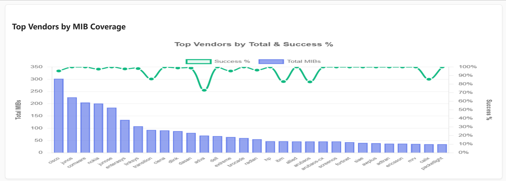
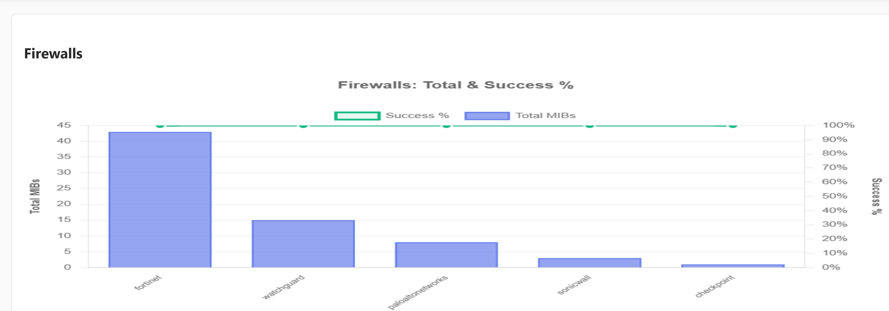
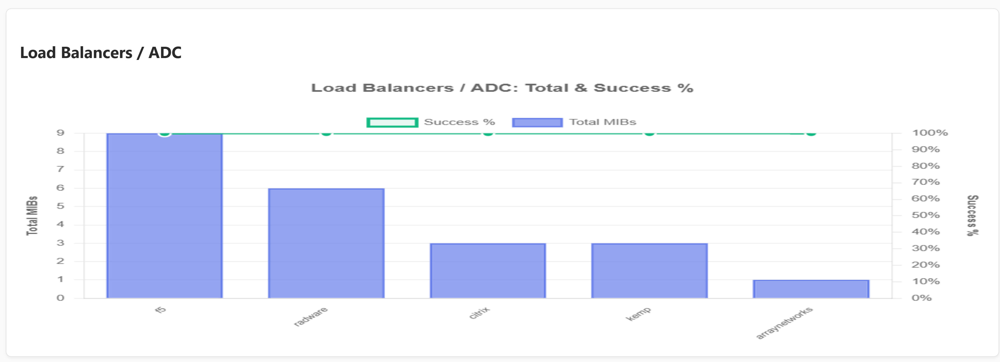
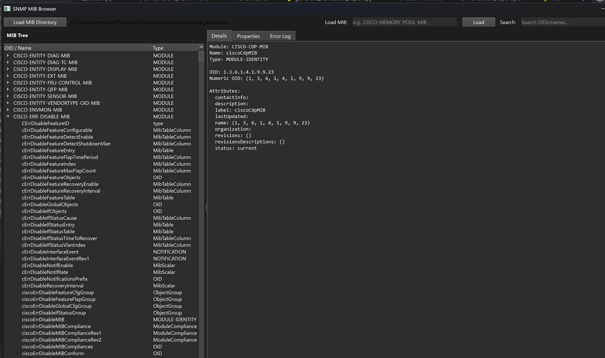
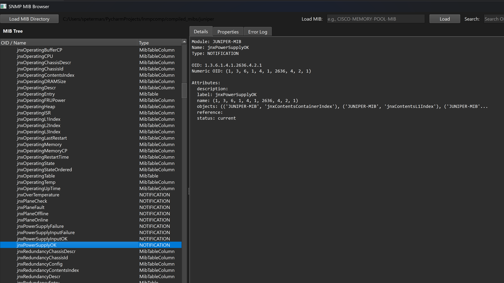
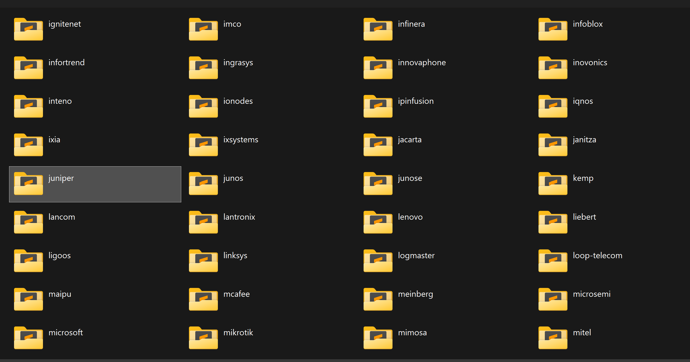

# python-librenms-mibs

**Compiled SNMP MIBs for Python from LibreNMS**

A comprehensive collection of 298 vendor MIB libraries compiled for use with PySNMP, sourced from the LibreNMS project's curated MIB repository. This project provides tools to compile, validate, and browse SNMP MIBs, plus pre-compiled distributions ready for immediate use.

[]()
[]()
[]()

## The Problem

The Python SNMP ecosystem has excellent libraries like PySNMP, easysnmp, and puresnmp, but developers consistently hit the same friction points:

- No centralized pre-compiled MIB distributions
- Manual compilation of vendor MIBs is tedious and error-prone
- Inconsistent success rates when compiling from various sources
- No easy way to explore and validate MIB collections

This project eliminates those roadblocks by providing battle-tested, pre-compiled MIBs and the complete toolchain to work with them.

## What You Get

### Pre-compiled MIBs
Download and use immediately—no compilation required. Available in [Releases](../../releases) with MIBs organized by vendor.

### Complete Toolchain
- **lnmsc.py** - Single vendor MIB compiler
- **batch_compile_mibs.py** - Batch compilation with detailed reporting
- **check_mibs.py** - Individual vendor validation
- **batch_validate_mibs.py** - Comprehensive validation with metrics
- **pymibbrowser.py** - GUI browser for exploring compiled MIBs

### Validation Results


*Validation success across top vendors by MIB count*

**Overall Statistics:**
- **Total Vendors:** 298
- **Total MIBs:** 4,242
- **Successfully Validated:** 4,130 (97.36%)
- **100% Success Rate:** 271 vendors
- **90%+ Success Rate:** 27 vendors

**Top Vendors by MIB Count:**

| Vendor | Total MIBs | Success Rate |
|--------|------------|--------------|
| Cisco | 302 | 95.4% |
| Juniper (JunOS) | 226 | 100.0% |
| HP Comware | 205 | 100.0% |
| Nokia | 201 | 97.5% |
| Juniper (JunOSE) | 184 | 100.0% |
| Enterasys | 134 | 97.8% |
| Linksys | 108 | 98.1% |
| Transition | 93 | 86.0% |
| Ciena | 91 | 100.0% |
| D-Link | 88 | 98.9% |

### Security Vendors


*All major firewall vendors achieve 100% validation success*

- **Fortinet:** 43 MIBs (100%)
- **WatchGuard:** 15 MIBs (100%)
- **Palo Alto:** 8 MIBs (100%)
- **SonicWALL:** 3 MIBs (100%)
- **Check Point:** 1 MIB (100%)

### Load Balancers / ADC


*Application delivery controllers with perfect validation rates*

- **F5:** 9 MIBs (100%)
- **Radware:** 6 MIBs (100%)
- **Citrix:** 3 MIBs (100%)
- **Kemp:** 3 MIBs (100%)
- **Array Networks:** 1 MIB (100%)

See [VALIDATION.md](VALIDATION.md) for complete results.

## Requirements

```bash
pip install pysmi pysnmp PyQt6
```

- **Python:** 3.8+
- **pysmi:** MIB compilation
- **pysnmp:** MIB loading and manipulation
- **PyQt6:** Graphical MIB browser (optional)

## Quick Start

### Using Pre-compiled MIBs

1. Download compiled MIBs from [Releases](../../releases)
2. Extract to your project directory
3. Use with PySNMP:

```python
from pysnmp.smi import builder

# Load Cisco MIBs
mib_builder = builder.MibBuilder()
mib_builder.add_mib_sources(builder.DirMibSource('./compiled_mibs/cisco'))
mib_builder.load_modules('CISCO-MEMORY-POOL-MIB', 'CISCO-PROCESS-MIB')

# Now use with SNMP queries...
```

### Compiling Your Own MIBs

```bash
# Clone LibreNMS for source MIBs
git clone https://github.com/librenms/librenms.git

# Compile all vendors
python batch_compile_mibs.py --source librenms/mibs --output ./compiled_mibs --offline

# Validate compiled MIBs
python batch_validate_mibs.py --input ./compiled_mibs --markdown validation.md
```

### Browse MIBs with the GUI


*PyQt6-based MIB browser showing hierarchical navigation and detailed object information*

```bash
# Launch the MIB browser
python pymibbrowser.py

# Then: Load MIB Directory → select compiled_mibs/cisco
```


*Exploring Juniper MIB objects with full OID paths and attribute details*

## Tool Usage

### Batch Compilation

Compile multiple vendor MIB directories:

```bash
# Compile all vendors
python batch_compile_mibs.py --source ./mibs --output ./compiled_mibs

# Compile specific vendors
python batch_compile_mibs.py --source ./mibs --output ./compiled_mibs \
    --vendors cisco,juniper,arista,fortinet

# Compile and validate
python batch_compile_mibs.py --source ./mibs --output ./compiled_mibs --validate

# Offline mode (no network fallbacks)
python batch_compile_mibs.py --source ./mibs --output ./compiled_mibs --offline
```

### Batch Validation

Validate entire MIB collection:

```bash
# Validate all vendors
python batch_validate_mibs.py --input ./compiled_mibs

# Generate detailed reports
python batch_validate_mibs.py --input ./compiled_mibs \
    --output validation_report.json \
    --markdown VALIDATION.md

# Verbose output
python batch_validate_mibs.py --input ./compiled_mibs -v
```

### MIB Browser Features

- **Tree Navigation:** Hierarchical view of MIB modules and symbols
- **OID Display:** Shows numeric OID paths alongside names
- **Details Panel:** Complete object information (syntax, access, status, description)
- **Search:** Real-time filtering by OID or name
- **Error Logging:** Track issues with specific MIBs

## Integration Examples

### With PySNMP

```python
from pysnmp.hlapi import *
from pysnmp.smi import builder

# Setup MIB builder
mib_builder = builder.MibBuilder()
mib_builder.add_mib_sources(builder.DirMibSource('./compiled_mibs/cisco'))

# Perform SNMP GET
iterator = getCmd(
    SnmpEngine(),
    CommunityData('public'),
    UdpTransportTarget(('192.168.1.1', 161)),
    ContextData(),
    ObjectType(ObjectIdentity('CISCO-MEMORY-POOL-MIB', 'ciscoMemoryPoolUsed', 1))
)

errorIndication, errorStatus, errorIndex, varBinds = next(iterator)

for varBind in varBinds:
    print(' = '.join([x.prettyPrint() for x in varBind]))
```

### With easysnmp

```python
from easysnmp import Session

# Point to compiled MIBs
session = Session(
    hostname='192.168.1.1',
    community='public',
    version=2,
    use_numeric=False
)

# Query using MIB names
result = session.get('sysDescr.0')
print(f"{result.oid} = {result.value}")
```

## Vendor Coverage


*Organized vendor directories ready for use*

### Enterprise Networking
Cisco, Juniper, Arista, Dell, HP/HPE, Extreme Networks, Brocade, Allied Telesis, Enterasys, Nokia/Alcatel-Lucent

### Wireless & Access Points
Aruba, Ruckus, Aerohive, Cambium, Ubiquiti, Mikrotik

### Security Appliances
Fortinet, Palo Alto Networks, Check Point, WatchGuard, SonicWALL, Barracuda

### Load Balancers
F5, Radware, Citrix, Kemp, Array Networks

### Service Provider Equipment
Ciena, Adtran, Calix, Dasan, Transition Networks, RAD, Telco Systems

### Storage & Servers
Dell/EqualLogic, NetApp, IBM, Synology, QNAP

### Power & Environmental
APC, Eaton, Raritan, ServerTech, Geist

### Industrial & IoT
Moxa, Advantech, Phoenix Contact, Westermo

**Total: 298 vendors across all categories**

See [VENDOR_LIST.md](VENDOR_LIST.md) for the complete vendor list with statistics.

## Project Structure

```
python-librenms-mibs/
├── lnmsc.py                      # Single vendor MIB compiler
├── batch_compile_mibs.py         # Batch compilation tool
├── check_mibs.py                 # Single vendor validator
├── batch_validate_mibs.py        # Batch validation tool
├── pymibbrowser.py               # GUI MIB browser
├── README.md                     # This file
├── VALIDATION.md                 # Validation results
├── VENDOR_LIST.md                # Complete vendor list
├── LICENSE                       # MIT License
├── screenshots/                  # Documentation images
└── compiled_mibs/                # Pre-compiled MIBs (in releases)
    ├── cisco/
    ├── juniper/
    ├── arista/
    └── ...
```

## Known Limitations

- **Compilation:** Some vendor MIBs have ASN.1 syntax issues and fail to compile (documented in reports)
- **Validation:** A few MIBs compile but fail PySNMP validation due to dependencies or advanced features
- **Legacy Equipment:** Older/obsolete vendor MIBs may have lower success rates
- **Browser:** Read-only tool for exploration—does not perform live SNMP queries

The pre-compiled distributions include only MIBs that successfully validated.

## Attribution & Licensing

### This Project
- **License:** MIT License
- **Copyright:** 2025 [Your Name/Handle]
- Tools and compilation scripts are MIT licensed

### Source MIBs
- **Source:** [LibreNMS MIB Repository](https://github.com/librenms/librenms/tree/master/mibs)
- **Copyright:** Individual MIB files retain their original vendor copyrights
- **License:** MIBs are subject to their respective vendor license terms

### Important Notes
- This is an **independent project**—not affiliated with or endorsed by LibreNMS
- LibreNMS has curated these MIBs over many years—full credit to their team
- Vendor MIB copyrights remain with original vendors (Cisco, Juniper, etc.)
- Users should review vendor licensing terms for commercial use
- Compiled Python modules (.py files) are derivatives of the original MIBs

### Acknowledgments
- **LibreNMS Team:** For maintaining the comprehensive MIB repository
- **PySNMP/pysmi:** For the excellent Python SNMP implementation and MIB compiler
- **PyQt:** For the GUI framework
- **All Vendors:** For publishing their MIBs

## Contributing

Contributions welcome! Areas for improvement:

- Additional vendor MIB sources
- Improved compilation success rates
- MIB browser enhancements
- Integration examples
- Documentation improvements

Please ensure:
1. Respect vendor MIB copyrights
2. Document MIB sources clearly
3. Run validation on any new MIBs
4. Update documentation

## Support & Issues

- **Issues:** Use GitHub Issues for bugs or feature requests
- **Discussions:** Use GitHub Discussions for questions
- **Updates:** Watch releases for new compiled MIB versions

## Version History

### v1.0.0 (2025-10-02)
- Initial release
- 298 vendor collections
- 4,242 compiled MIBs
- 97.36% validation success
- Complete toolchain (compile, validate, browse)
- Pre-compiled distributions

## References

- [LibreNMS](https://www.librenms.org/) - Network monitoring system
- [LibreNMS MIB Repository](https://github.com/librenms/librenms/tree/master/mibs)
- [PySNMP Documentation](https://pysnmp.readthedocs.io/)
- [pysmi Documentation](https://pysmi.readthedocs.io/)
- [RFC 3411-3418](https://tools.ietf.org/html/rfc3411) - SNMP v3 specifications

---

**Note:** This project makes SNMP MIBs accessible to the Python community. For actual network monitoring with these MIBs, consider [LibreNMS](https://www.librenms.org/) or other monitoring platforms.